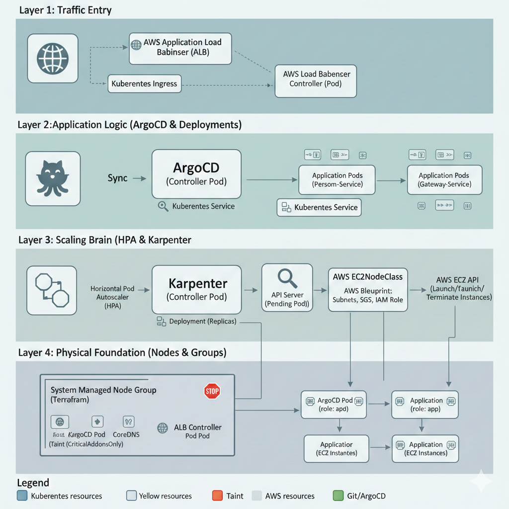
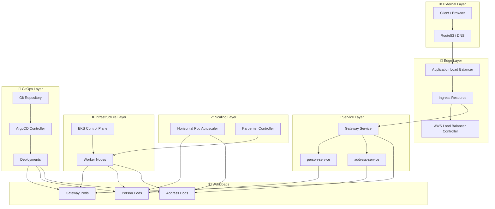
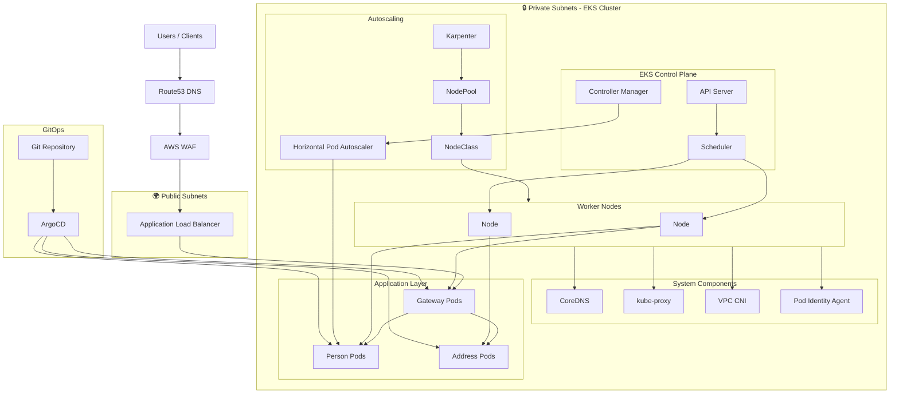

## Importance of the Control Plane

| Feature              | Role of Control Plane                                          |
|----------------------|----------------------------------------------------------------|
| Cluster Management   | Defines and applies the desired state (via YAMLs, Helm, etc.)  |
| Scheduling           | Decides where to run your containers                           |
| Scaling              | Adds/removes pods to match desired replicas                    |
| Monitoring & Healing | Restarts failed pods, reassigns workloads                      |
| Security             | Controls access through the API server                         |
| Networking           | Manages service discovery and routing                          |

## Key Components of the Control Plane

| kube-apiserver (API Server) | The Front Door of the Cluster     | All control plane communication goes through it (CLI, UI, kubelet, etc.).<br>Validates and processes REST requests (e.g., from kubectl).<br>Acts as a gatekeeper to the cluster.<br>Example: kubectl get pods  →  hits the API server                                                                                                          |
| --------------------------- | --------------------------------- | ---------------------------------------------------------------------------------------------------------------------------------------------------------------------------------------------------------------------------------------------------------------------------------------------------------------------------------------------- |
| etcd                        | The Brain/Database of the Cluster | A distributed, key-value store used to store all cluster state.<br>Example: what pods are running, what nodes exist, configmaps, secrets, etc.<br>Highly critical—if etcd fails, the cluster loses its state.                                                                                                                                  |
| kube-scheduler              | The Job Allocator                 | Watches for new Pods without a node assigned.<br>Chooses the most suitable node based on:<br> • CPU/memory availability<br> • Node labels/taints<br> • Affinity rules                                                                                                                                                                          |
| kube-controller-manager     | The Automation Engine             | Runs several built-in controllers that continually reconcile desired state with actual state:<br> • Deployment Controller: Ensures the correct number of pods are running.<br> • Node Controller: Monitors node health.<br> • Job Controller, ReplicaSet Controller, etc.<br><br>Think of it like background services keeping things in check. |
| cloud-controller-manager    | Cloud Integration Layer           | Manages cloud-specific controller logic (e.g., for AWS, Azure, GCP).<br>Handles:<br> • Load balancer provisioning<br> • Node discovery<br> • Persistent volume integration with cloud storage                                                                                                                                                  |

### Analogy: Airport Control Tower
| Control Plane Component | Airport Equivalent                          |
|-------------------------|---------------------------------------------|
| kube-apiserver          | Air traffic controller                      |
| etcd                    | Flight schedule/records                     |
| scheduler               | Decides which runway (node) to use          |
| controller-manager      | Monitors flights, gates, baggage operations |

### Kubelet
The kubelet is the primary "node agent" that runs on each node. It can register the node with the apiserver using one of: the hostname; a flag to override the hostname; or specific logic for a cloud provider.

The kubelet works in terms of a PodSpec. A PodSpec is a YAML or JSON object that describes a pod. The kubelet takes a set of PodSpecs that are provided through various mechanisms (primarily through the apiserver) and ensures that the containers described in those PodSpecs are running and healthy. The kubelet doesn't manage containers which were not created by Kubernetes.

## The Core Principle

``` 
In EKS, the control plane does NOT initiate outbound connections into your VPC.
Worker nodes initiate and maintain connections to the control plane.
```

### Visual Flow

[ Pod crashes ]
      ↓
Node notices
      ↓  (outbound)
Control plane updates desired state
      ↓
Scheduler assigns pod
      ↓
Node sees assignment (watch)
      ↓
Node starts pod

## High-Level Architecture

Internet
   ↓
Route 53
   ↓
AWS ALB (via AWS Load Balancer Controller)
   ↓
Kubernetes Ingress
   ↓
Spring Cloud Gateway
   ↓
Microservices (person, address, ordering, etc.)
   ↓
Databases / External Services

## Control Plane Endpoint Access
EKS gives us 3 options:

| Option           | Meaning                      | Recommended  |
|------------------|------------------------------|--------------|
| Public only      | API accessible from internet | ❌ No         |
| Public + Private | Internet + VPC               | ⚠️ Maybe     |
| Private only     | Only from VPC                | ✅ Yes (prod) |


## Recommended Subnet Layout
Public Subnet
  └── ALB / NLB only

Private Subnet
  ├── EKS worker nodes
  ├── Pods
  └── NAT Gateway route

Isolated Subnet
  └── RDS / ElastiCache

##  Visual Mental Model
AWS Managed VPC
┌──────────────────────────┐
│ EKS Control Plane        │
│ - API Server             │
│ - etcd                   │
└─────────▲────────────────┘
          │ Private endpoint
          │
User VPC  │
┌──────────────────────────┐
│ Private Subnets          │
│ - Worker Nodes           │
│ - Pods                   │
│                          │
│ Public Subnets           │
│ - ALB                    │
└──────────────────────────┘

## Common Misconceptions

“Control plane should be in private subnets”
→ You don’t control that in EKS

“I need to open inbound ports to nodes”
→ No, nodes only need outbound

“API server must be public for kubectl”
→ No, use VPN / bastion

## Example: What Happens When we Deploy a Pod in EKS
	1.	Run kubectl apply -f deployment.yaml
	2.	kubectl sends request to EKS control plane (API server) endpoint.
	3.	The etcd stores the new desired state.
	4.	The scheduler assigns a node to the Pod.
	5.	The controller manager creates the necessary ReplicaSet/Pod resources.
	6.	The worker node (EC2/Fargate) pulls the container image and starts the Pod.

## Visual Mapping

+-------------------------------+
|         AWS Managed           |
|-------------------------------|
| kube-apiserver                |
| etcd                          |
| kube-scheduler                |
| kube-controller-manager       |
| cloud-controller-manager      |
+-------------------------------+
            |
            ↓
+-------------------------------+
|      VPC (User Managed)       |
|-------------------------------|
| Worker Nodes (EC2 or Fargate) |
| CoreDNS, kube-proxy, etc.     |
| Pods, Services, Volumes       |
+-------------------------------+

## Tools to Interact with EKS
	•	eksctl — CLI tool to provision EKS clusters (recommended for setup).
	•	kubectl — for managing resources (Pods, Services, etc.).
	•	IAM Roles for Service Accounts (IRSA) — to give fine-grained AWS access to Pods.
	•	CloudWatch — for logs and metrics (via container insights).

### Summary

| Task              | Recommendation                                         |
|-------------------|--------------------------------------------------------|
| Cluster           | Use eksctl or Terraform to create EKS                  |
| Ingress           | Use ALB Ingress Controller for HTTP(S) routing         |
| Deployment        | Use kubectl or Helm in CI/CD                           |
| YAMLs             | Structure per-service manifests, or use Helm charts    |
| Auth              | Use IAM Roles for Service Accounts                     |
| Gradual Migration | Migrate and test one service at a time                 |
| Monitoring        | Use CloudWatch, Prometheus, or Grafana for visibility  |
| Storage           | Use EFS or S3 where applicable                         |
| DNS               | Route 53 -> ALB Ingress -> Kubernetes Services         |


## K8 yaml config summary

| Element    | Field                     | Used For                                 |
|------------|---------------------------|------------------------------------------|
| Deployment | metadata.labels           | Identification (optional)                |
| Deployment | spec.selector.matchLabels | Links Deployment to Pods                 |
| Pod        | template.metadata.labels  | Must match selector above                |
| Service    | spec.selector             | Routes traffic to Pods                   |
| Container  | name                      | Internal name only (not used in linking) |

### Visual map
[Deployment]
  └── spec.selector.matchLabels = app: service-a
         └── matches →
             [Pods created by Deployment]
                 └── metadata.labels = app: service-a
                       └── matched by →
                           [Service]
                             └── spec.selector = app: service-a

## Deployment vs Service

| Resource   | Purpose                                | Key Concepts                       |
|------------|----------------------------------------|------------------------------------|
| Deployment | Declaratively manage Pods and scaling  | Replicas, selectors, templates     |
| Service    | Network abstraction for accessing pods | DNS, load balancing, service types |

## Notes

```
Kubernetes is eventually consistent, not continuously dependent.

etcd is strong consistency.

Everything in Kubernetes is state — and state lives in etcd.
```

- Make sure to set ```discover-enabled``` label to make services discovered by spring k8 discovery client.

## Autoscaling
- HPA (Horizontal Pod Autoscaler) - Sclaes Pods
- CA (Cluster Autoscaler) - Scales Nodes

Traffic ↑
   ↓
HPA scales pods
   ↓
No node capacity
   ↓
Cluster Autoscaler adds nodes

### Requirement Components
- Metrics server (minikube addons enable metrics-server) - the "source of truth" for the HPA
- Horizontal Pod Autoscaler (HPA)
- Karpenter or Cluster Autoscaler

### HPA
The HPA acts like a thermostat. You set a target (e.g., 60% CPU usage), and the HPA constantly checks the pods. If they exceed that target, it tells the Deployment to increase the replica count.

- Define resources in deployment.yaml

```
resources:
  requests: # The scheduler uses these values to decide which node your Pod should go on. (min gurantee)
    cpu: "100m" # e.g. Kubernetes will find a node that has at least this much "unreserved" CPU.  100m = 10% of a CPU core
    memory: "256Mi" # Kubernetes ensures the node has this much RAM available before placing the Pod.
  limits: # This is the maximum amount of resources the Pod is allowed to consume. (Hard ceiling)
    cpu: "500m" # e.g app can burst up to 50% of a CPU core.
    memory: "512Mi" # max memory allowed to use.
```
- Enable HPA (see hpa.yaml)

### Karpenter
- an open-source project designed to enhance node lifecycle management within Kubernetes clusters. It automates provisioning and deprovisioning of nodes based on the specific scheduling needs of pods, allowing efficient scaling and cost optimization.

#### Component
- IAM role (for the Nodes karpenter will create).
- Karpenter Controller (terrafom + helm template)
- Node pool

####
- Subnets Tags (karpenter.sh/discovery: <cluster-name>)
- Node security group tags (karpenter.sh/discovery)


### Rolling Updates (Zero downtime)
Deployment Update Flow
	1.	New ReplicaSet created
	2.	New pods started
	3.	Readiness probes pass
	4.	Old pods terminated gradually

### What happens when a Node dies

Node dies
   ↓
Kubelet stops heartbeats
   ↓
Control plane marks NotReady
   ↓
Pods evicted
   ↓
Scheduler reschedules
   ↓
ASG (Auto Scaling Group) launches new node

### PodDisruptionBudget (PDB)
- A PodDisruptionBudget defines how many pods of a workload are allowed to be unavailable during ```voluntary disruptions```.
- PDB tells Kubernetes: “Don’t take down too much of my app at once.”
- A PDB defines one of two constraints:

```
minAvailable: 2
or 
maxUnavailable: 1

```

#### Voluntary Disruption

Things Kubernetes (or operators) choose to do:
 - Node draining (for upgrades)
 - Cluster scaling down
 - Rolling updates
 - Manual kubectl drain
 - Managed node group updates

#### Example PDB
```
apiVersion: policy/v1
kind: PodDisruptionBudget
metadata:
  name: person-service-pdb
spec:
  minAvailable: 2
  selector:
    matchLabels:
      app: person-service
```
This means:
	Kubernetes will never voluntarily evict more than 1 pod at a time


#### Mental Model
- Pods heal your app.
- Nodes heal your infrastructure.
- Kubernetes orchestrates both.

## Configmap vs Secrets
- Both are stored in etcd
| Layer              | ConfigMaps | Secrets          |
|--------------------|------------|------------------|
| etcd storage       | Plaintext  | Base64           |
| At-rest encryption | ❌          | ✅ (EKS default)  |
| In-transit (TLS)   | ✅          | ✅                |

### Best Practice in EKS

| Use case       | Recommended          |
|----------------|----------------------|
| App config     | ConfigMap            |
| DB credentials | AWS Secrets Manager  |
| AWS access     | IRSA                 |
| TLS certs      | cert-manager + ACM   |


## RBAC
### Two layers in EKS

AWS IAM (Who can talk to the cluster)
        ↓
Kubernetes RBAC (What they can do inside)

### Kubernetes RBAC

``` “Once inside the cluster, what are you allowed to do?” ```

### Subjects
- Users
- Groups
- Service Accounts

### RABC Objects

| Object             | Purpose                       |
|--------------------|-------------------------------|
| Role               | Permissions in one namespace  |
| ClusterRole        | Permissions cluster-wide      |
| RoleBinding        | Attach Role to subject        |
| ClusterRoleBinding | Attach ClusterRole to subject |

### Example role and rolebinding

```
kind: Role
apiVersion: rbac.authorization.k8s.io/v1
metadata:
  namespace: dev
  name: pod-reader
rules:
- apiGroups: [""]
  resources: ["pods"]
  verbs: ["get", "list"]

```
```
kind: RoleBinding
apiVersion: rbac.authorization.k8s.io/v1
metadata:
  name: read-pods
  namespace: dev
subjects:
- kind: ServiceAccount
  name: app-sa
roleRef:
  kind: Role
  name: pod-reader
  apiGroup: rbac.authorization.k8s.io
```
### How EKS Authenticates Users
kubectl
  ↓ (IAM auth)
AWS STS
  ↓
EKS API Server
  ↓
Kubernetes RBAC

### aws-auth ConfigMap

- aws-auth is the bridge between AWS IAM and Kubernetes RBAC.
- Lives in kube-system namespace
- Maps IAM roles &  IAM users → to Kubernetes users/groups
It defines:
	•	Who can authenticate to Kubernetes
	•	What Kubernetes identity they assume

### aws-auth ConfigMap workflow

Human
 ↓
Assume IAM role (e.g. eks-dev-role)
 ↓
Allowed: eks:DescribeCluster
 ↓
EKS API authenticates via aws-auth
 ↓
Mapped to K8s group (e.g. developers)
 ↓
RBAC allows actions

### RABC - IAM Role Association

Kubernetes Role / ClusterRole
        ↓
RoleBinding / ClusterRoleBinding
        ↓
Kubernetes Group   (string)
        ↑
aws-auth ConfigMap
        ↑
IAM Role

### Example

```
# Kubernetes Role (namespace-scoped permissions)

apiVersion: rbac.authorization.k8s.io/v1
kind: Role
metadata:
  name: dev-read-role
  namespace: dev
rules:
  - apiGroups: [""]
    resources:
      - pods
      - services
      - configmaps
    verbs:
      - get
      - list
      - watch

  - apiGroups: ["apps"]
    resources:
      - deployments
      - replicasets
    verbs:
      - get
      - list
      - watch

# RoleBinding (bind role to a GROUP)

apiVersion: rbac.authorization.k8s.io/v1
kind: RoleBinding
metadata:
  name: dev-read-binding
  namespace: dev
subjects:
  - kind: Group
    name: developers   # <-- Kubernetes group name
    apiGroup: rbac.authorization.k8s.io
roleRef:
  kind: Role
  name: dev-read-role
  apiGroup: rbac.authorization.k8s.io


# aws-auth ConfigMap (IAM → K8s mapping)

apiVersion: v1
kind: ConfigMap
metadata:
  name: aws-auth
  namespace: kube-system  # built-in namespace
data:
  mapRoles: |
    - rolearn: arn:aws:iam::123456789012:role/eks-dev-role
      username: dev-user
      groups:
        - developers

```

### RABC apiGroups attribute reference table

| Resource    | apiGroup                  |
|-------------|---------------------------|
| pods        | ""                        |
| services    | ""                        |
| configmaps  | ""                        |
| secrets     | ""                        |
| deployments | apps                      |
| replicasets | apps                      |
| ingresses   | networking.k8s.io         |
| jobs        | batch                     |
| roles       | rbac.authorization.k8s.io |

### Who gets what

| Persona       | Access                   |
|---------------|--------------------------|
| Platform team | ClusterRole              |
| App teams     | Namespace Roles          |
| CI/CD         | Limited ClusterRole      |
| Humans        | Read-only where possible |


### Notes
- Pods authenticate using ServiceAccounts
- IAM decides “who you are”
- RBAC decides “what you can do”
- We dot not create RABC Groups. Group exists only by name.
- Make sure to include the correct ```apiGroup``` in the role definition.
- ```kube-system``` is a built-in namespace created automatically when a cluster is initialized.
- Make sure to add toleration for coreDNS addon
- Make sure to add ```before_compute``` flag for vpc-cni and eks-pod-identity-agent addons. Without that the nodes can't register with API server.

### How to access the API server using kubectl

User logs in via SSO
   ↓
Assumes IAM role (e.g., EKS-Dev-Admin)
   ↓
kubectl signs request with temporary credentials
   ↓
EKS API sees principal ARN
   ↓
EKS API checks access entry
   ↓
If authorized → Kubernetes RBAC enforces permissions

1) Create an IAM policy with necessary access to eks cluster (e.g. eks:DescribeCluster, eks:DescribeNodegroup, etc)
2) Create an IAM role (e.g trocks-eks-iam-role) and add the policy created in step 1.
3) Create an IAM user and add permission (sts:assumeRole) to assume the role created in step 2.
4) Map the IAM role created in step 2 to a cluster policy (e.g. AmazonEKSClusterAdminPolicy) in the EKS console.
As an IAM user (created in step 3),
    1) Run ``` aws eks update-kubeconfig --name trocks-manual --region us-east-2 --role-arn <role:arn created in step 2>``` to update the kube config (~/.kube/config). Configures kubectl so that you can connect to an Amazon EKS cluster.
    e.g. 
    ```
    aws eks update-kubeconfig --name trocks-manual --region us-east-2 --role-arn arn:aws:iam::XXXXXXXXX:role/trocks-eks-iam-role
    ```

    2) Now, use kubectl to access the cluster.
    e.g.
    
    ``` kubectl get pods  ```

### How to give terraform access to EKS
- Resources are created in phases.
Phase 1 → EKS control plane exists (Create Infra resources like IAM, VPC, Cluster (with access_entry))
    - access_entry - maps IAM role to a cluster role.
Phase 2 → IAM ↔ EKS access entries exist
Phase 3 → Kubernetes provider authenticates (configure kubernetes provider configuration to authenticate with EKS)
    - This phase will use the cluster_ca_certificate and aws eks get-token to authenticate with EKS.
Phase 4 → Kubernetes resources are created (e.g namespaces, configmaps, etc)

## EKS deployment

Internet
   ↓
Route 53
   ↓
ALB (AWS Load Balancer Controller)
   ↓
Ingress (K8s)
   ↓
Spring Cloud Gateway
   ↓
Person Service  ↔  Address Service
          ↑
     Spring Cloud Config


                      ┌───────────────────────────────┐
                      │          Clients             │
                      │  (Browser, Mobile, CI/CD)    │
                      └─────────────┬─────────────────┘
                                    │
                                    ▼
                          ┌─────────────────┐
                          │   Route 53 DNS  │
                          │  (api.trocks.com) │
                          └─────────┬─────────┘
                                    │
                                    ▼
                          Public / Private ALB / NLB
                                    │
                                    ▼
┌─────────────────────────────────────────────────────────┐
│                    EKS Cluster Control Plane            │
│  (AWS-managed: API Server, Scheduler, etcd, Controllers)│
└─────────────────────────────────────────────────────────┘
                   ▲                      ▲
                   │                      │
                   │                      │
                   │                      │
        ┌──────────┘                      └───────────┐
        │                                               │
        ▼                                               ▼
 ┌───────────────┐                           ┌────────────────┐
 │  System Node  │                           │   App Node     │
 │   Group       │                           │   Group(s)     │
 │ (tainted)     │                           │ (untainted)    │
 │---------------│                           │----------------│
 │ CoreDNS       │                           │ person-service │
 │ kube-proxy    │                           │ address-service│
 │ VPC CNI       │                           │ cloud-config   │
 │ CloudWatch    │                           │ cloud-gateway  │
 │ ALB Controller│                           │ other services │
 │ MetricsServer │                           │ HA / replicas  │
 └───────────────┘                           └────────────────┘
        ▲                                               ▲
        │                                               │
        └───────────────────────────────────────────────┘
                         VPC Private Subnets
                         (ENIs for control plane)

### Tools
- ```eksctl``` is a command-line tool that simplifies creating, managing, and operating Amazon Elastic Kubernetes Service (EKS) clusters, automating complex tasks like VPC setup and IAM role creation through simple CLI commands or declarative YAML files, making EKS management easier for DevOps engineers and platform teams.

- ```kubectl```: The kubectl command line tool is the main tool you will use to manage resources within your Kubernetes cluster. This page describes how to download and set up the kubectl binary that matches the version of your Kubernetes cluster.

-- ```helm```: package manager for Kubernetes

### Recommended Approach to Create & Manage EKS
| Tool            | Use it for     | Recommended  |
|-----------------|----------------|--------------|
| AWS Console     | Viewing only   | ✅ Yes        |
| eksctl          | PoC / learning | ⚠️ Limited   |
| Terraform       | Prod infra     | ✅ YES        |
| Helm            | Add-ons        | ✅ YES        |
| kubectl         | Debugging      | ✅ YES        |
| GitOps (ArgoCD) | App deploy     | ⭐ Best       |

### EKS Modes

| Mode                      | Who manages nodes | Who manages scaling | Infra control | Typical use             |
|---------------------------|-------------------|---------------------|---------------|-------------------------|
| Managed Node Groups (EC2) | You               | You                 | High          | Most prod workloads     |
| Self-managed Nodes        | You               | You                 | Full          | Custom OS / edge cases  |
| EKS Fargate               | AWS               | AWS                 | Low           | Small, bursty, secure   |
| EKS Auto Mode             | AWS               | AWS                 | Very low      | New / simplified ops    |

### Two Ways to Provision EKS with Terraform
- Using the terraform-aws-eks module (Community Module) - terraform-aws-modules/eks/aws
- Using Raw aws_eks_ Resources*

### When Are kube-system Pods Created
Step 1: EKS cluster created
	•	Control plane comes up (AWS-managed)
	•	No nodes yet
	•	No pods yet

Step 2: Node group created
	•	EC2 instances boot
	•	kubelet registers nodes
	•	Nodes appear in cluster

Step 3: Core system pods are created
Immediately after nodes appear:
	•	CoreDNS
	•	kube-proxy
	•	VPC CNI
	•	Other add-ons

These pods are created by:
	•	Kubernetes controllers
	•	EKS add-on manager

👉 They are created ONLY AFTER nodes exist

### Taints
- A taint is a “KEEP OUT” sign placed on a node.
- It tells Kubernetes: “Do not schedule pods here unless the pod explicitly allows (tolerates) it.”
- Syntax: ``` key=value:effect ```
- Example, ```node-role=system:NoSchedule```

#### The 3 Taint Effects
- NoSchedule - New pods will not be scheduled unless tolerated
- PreferNoSchedule - Scheduler tries to avoid, but may schedule
- NoExecute - Pod is evicted immediately if it doesn’t tolerate

#### Toleration
- A toleration is a pod saying: “I am allowed past this taint.”
- Without toleration → pod is rejected.

#### Toleration example with Taints
```
- key: "node-role"
  operator: "Equal"
  value: "system"
  effect: "NoSchedule"
```
This pod can run on nodes tainted with:
``` node-role=system:NoSchedule ```

- ``` node-role.kubernetes.io/system=true:NoSchedule``` - This means that Keep all pods out of this node unless the pod explicitly tolerates this taint. Since system pods tolerate (AWS sets toleration for system pods) this taint, they are allowed to run in the tainted nodes whereas the app pods do not have the toleration set so they are KEPT OUT of these tainted nodes. 

- The toleration does NOT mean “system pods must run here.” It only means: “System pods are allowed to run here”

### Affinity
- Affinity is essentially "matchmaking" for our Pods. While a nodeSelector is a simple "must-have" label, Affinity gives us a rich language to define complex rules for where Pods should—or shouldn't—live.
- three main categories: Node Affinity, Pod Affinity, and Pod Anti-Affinity.

#### Node Affinity
This is used to attract Pods to specific nodes based on node labels (like GPU types, instance types, or custom environment tags).

#### Pod Affinity & Anti-Affinity
This is about where Pods live relative to other Pods.

| Attribute       | Purpose                   | Example                                   |
|-----------------|---------------------------|-------------------------------------------|
| nodeAffinity    | Pod-to-Node relationship  | "Only run on nodes with SSDs"             |
| podAffinity     | Pod-to-Pod (Togetherness) | "Put my API pod next to my Cache pod"     |
| podAntiAffinity | Pod-to-Pod (Separation)   | "Don't put two Gateway pods on one node"  |
| topologyKey     | The scope of the rule     | kubernetes.io/hostname (Node)             |
| operator        | The logic of the match    | In, NotIn, Exists                         |

#### Scheduling Rules
- ```requiredDuringSchedulingIgnoredDuringExecution``` (Hard Rule): The scheduler must find a node that meets the rule. If it can't, the Pod will stay in a Pending state.

- ```preferredDuringSchedulingIgnoredDuringExecution``` (Soft Rule): The scheduler will try to find a matching node. If it can't, it will ignore the rule and schedule the Pod anyway so your service stays up.

### Cluster Auth Mode vs API Server access
- Cluster authentication mode controls Who can authenticate (IAM → Kubernetes)
- API server endpoint access controles From where the API server can be reached

### Node group best practices
- kube-system Pods can go to any node group that the scheduler chooses. Use 'label' and 'taint' to place the kube-system pods in a dedicated node group.
- Do not mix kube-system pods and application pods in the same node group.
- EKS will never magically isolate workloads. We must design the isolation using 'label' and 'taint'.
- Use 'untainted' node groups for app node groups.

## Best Practices
- Never run prod services with 1 replica.
- PodDisruptionBudget - Prevents too many pods from being evicted at once.

## Helm
- Kubernetes/Helm, however, did create a "Secret" to track the release before it crashed.
- Helm cannot detect drifts.

## Deployement approach
###
Layer,Tool,Your Logic
Infra,Terraform,"VPC, EKS, IAM, and the ALB Controller."
CI,CodePipeline,Build Docker image → Push to ECR.
CD,CodePipeline,Runs a script to helm upgrade your app.


Infrastructure (Terraform): Still used for VPC, EKS, and "Cluster Bootstrapping" (installing the ALB Controller and ArgoCD).

CI (CodePipeline): Still builds the Docker image, but instead of "deploying," it simply updates a Git repo with the new image tag.

CD (ArgoCD): An agent inside the cluster watches your Git repo. When it sees the new tag, it automatically "pulls" the change and updates the cluster.

## ArgoCD

ArgoCD is a declarative, GitOps continuous delivery tool for Kubernetes.

```Think of it as a "Permanent Watchman" that sits between your Git repository (the "Truth") and your Kubernetes cluster (the "Reality"). Its sole job is to ensure that what is defined in Git is exactly what is running in your cluster.```

### Capabilities
1) ArgoCD constantly compares the Desired State (Git) with the Live State (EKS).
  - It checks the cluster every 3 minutes (by default).
2) Automatic Drift Detection & Correction.
3) Multi-Cluster Management.
4) Support for Multiple Manifest Tools

### Components
| Component                     | Replicated in HA? | Reason                                        |
|-------------------------------|-------------------|-----------------------------------------------|
| argocd-server                 | Yes (Default 3)   | Handles UI/API/CLI traffic.                   |
| argocd-repo-server            | Yes (Default 3)   | Handles Git cloning and manifest generation.  |
| argocd-application-controller | Yes (Sharded)     | Handles the actual syncing to K8s.            |
| Redis                         | Yes (Sentinel)    | Shared cache for all other components.        |

- argocd-server - stateless - scales horizontally
- repo-server - statless- scales horizontally
- application-controller - stateful - uses sharding - talks to the K8 API server - usually 1 replica is good enough

- see helm_release -> argocd resource under k8-resources to understand how to set replicas and affinity settings.


### How ArgoCD "Uses" Helm Internally

When you point ArgoCD at a Helm chart, it goes through a three-step process:

1) Rendering (helm template): ArgoCD runs the equivalent of helm template . --values values.yaml. It takes your chart and your values and turns them into raw, plain Kubernetes YAML manifests.

2) Comparison (The "Diff"): It compares that raw YAML against what is currently running in your EKS cluster.

3) Application (kubectl apply): If there’s a difference, it sends that raw YAML to the Kubernetes API using the same logic as kubectl apply.

## GitOps

GitOps is a modern operational framework that applies DevOps best practices (version control, code review, CI/CD) to infrastructure automation, using Git as the single source of truth for declaring the desired state of applications and infrastructure. Changes are made via Git commits (pull requests), and automated agents (operators) continuously sync the live environment to match the repository, enabling faster, more reliable, and auditable deployments, especially for Kubernetes.

- Git as the Source of Truth: All desired configurations (infrastructure, apps, policies) are stored as declarative code in a Git repository.
- Declarative Approach: Instead of scripting how to get to a state, you declare what the final state should be (e.g., using Kubernetes YAML, Terraform).
- Automated Sync: An agent (like Argo CD or Flux) runs in the cluster, continuously comparing the live state to the Git repo.
- Convergence: When differences (drift) are detected, the agent automatically pulls changes from Git and applies them to the cluster, bringing it back to the desired state.

## Security
### IAM (The "who")
- EKS Pod Identity - Use EKS Pod Identity to give the apps (app pods) an IAM role directly. This ensures the pod can only touch the specific AWS resources that it needs.
- RBAC Least Privilege - Avoid giving cluster-admin to anyone. Use Namespace-scoped Roles for developers.
- EKS Access Entries
### Network Security (The "Where")
- Private API Server - Ensure EKS API endpoint is Private.
- Security Groups for Pods
### Infra and Karpenter Security
- Node IAM Role Hardening - Ensure the IAM role used by Karpenter nodes has the bare minimum permissions.
- Encryption at Rest - Ensure EC2NodeClass specifies that all EBS volumes created by Karpenter are encrypted with a KMS Key.
### Secret Management
- External Secrets Operator - Use ESO to sync secrets from AWS Secrets Manager into Kubernetes Secrets.
- KMS Encryption for etcd
### Governance & GitOps (ArgoCD)
- Project Isolation - Use ArgoCD Projects to restrict which Git repos can deploy to which namespaces.

## References
- https://docs.aws.amazon.com/cli/latest/reference/eks/update-kubeconfig.html
- https://github.com/terraform-aws-modules/terraform-aws-eks/blob/master/examples/eks-managed-node-group/eks-bottlerocket.tf
- https://registry.terraform.io/modules/terraform-aws-modules/iam/aws/6.3.0
- https://github.com/aws/eks-charts/tree/master/stable/aws-load-balancer-controller
- https://artifacthub.io/packages/helm/aws/aws-load-balancer-controller
- https://helm.sh/docs/topics/charts/
- https://helm.sh/docs/chart_template_guide/values_files/
- https://developer.hashicorp.com/terraform/tutorials/kubernetes/helm-provider?in=terraform%2Fkubernetes
- https://kubernetes.io/docs/tasks/run-application/horizontal-pod-autoscale-walkthrough/

## Visualization




## 🧱 Layered Kubernetes Architecture



## 🚀 Production-Grade EKS Reference Architecture

